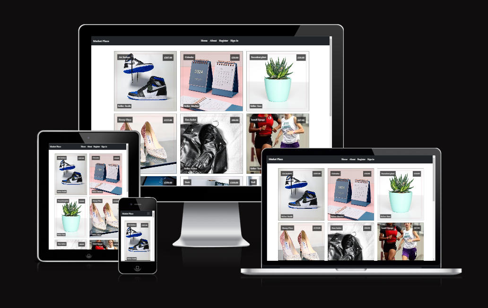
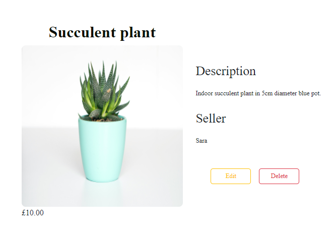
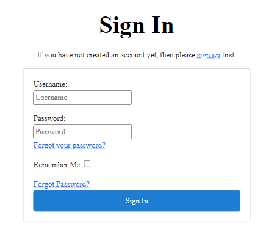
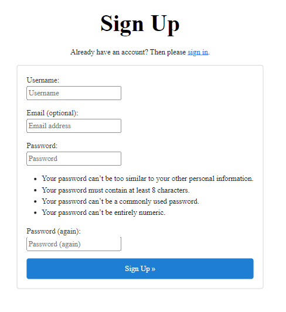
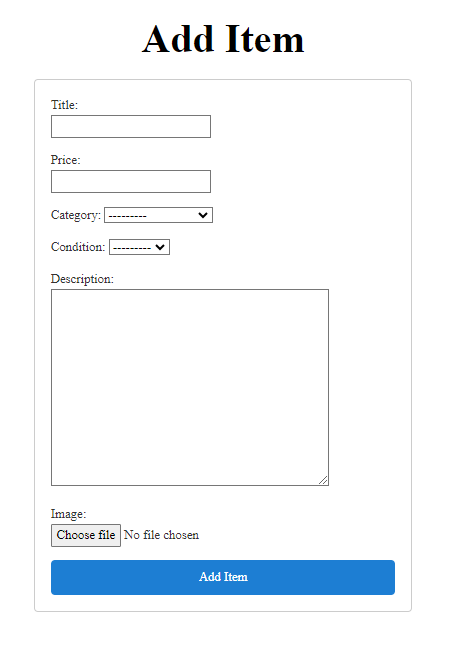
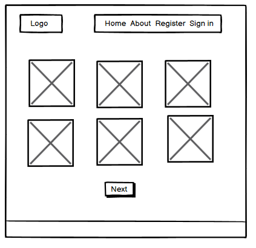
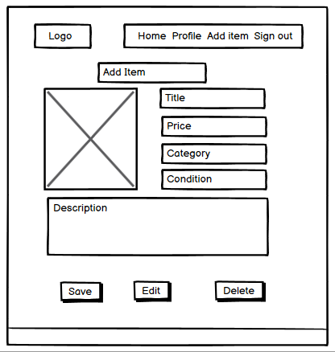
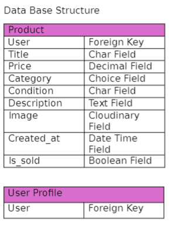

<h1 align='center'> College Market Place </h1>

View live project here: 
https://college-market-place-324ae99af0aa.herokuapp.com/

Welcome to College Marketplace, your centralized hub tailored specifically for the student community. Our platform is meticulously crafted to address the unique needs of students, aiming to reduce dependence on external platforms while ensuring a seamless experience for buyers.

## Index
* [User Experience](#user-experience-ux)
* [Features](#features)
* [Design](#design)
* [Technologies Used](#technologies-used)
* [Testing](#testing)
* [Deployment](#deployment)
* [Future Features](#future-features)
* [Credits](#credits)

## User Experience (UX)
As a user, I want to:
- Access the marketplace website seamlessly across various devices including desktops, laptops, tablets, and mobile phones.
- see the navigation bar contain clear and descriptive menu items that represent different sections or categories of the website.
- experience a consistent layout and design across all pages of the website, including the navigation bar's position, styling, and behavior.
- View a list of available products on the marketplace.
- Click on a product to view its detailed information including title, description, price, condition, seller information, and images.
- Create a new listing to sell items by providing details such as title, description, price, category, condition, and uploading images of the product.
- Modify existing product listings to update information such as title, description, price, category, condition, and images.
- Remove product listings that are no longer available for sale

## Features
__Landing Page :__
- Display of item images to capture user interest.

 __Navigation Bar :__
- Logo Integration for easy identification.
- Home: Directs users to the landing page showcasing available items.
- User Registration and Sign-In Page: Allows users to create an account or sign in if already registered.
- About: Provides an overview of the website's purpose and features.

__Product/Service Listing :__
- Comprehensive details including photos, descriptions, prices, categories and condition of the item.
- Functional buttons (save, edit, delete) empowering users to manage items according to their preferences, whether it's adding multiple items, saving for later, or removing unnecessary ones.

__Alert messages :__
- Alert message will pop up to confirm if the user signed in or out . Also when add or delete items.

__Footer :__
- The footer include recognizable icons or logos representing popular social media platforms such as Facebook, Twitter and Instagram.

__LogIn :__
- The login page has 2 clear options, username and password.
- If the username and password are not correct this error will show.

__Register :__
- It offers them space for a username, email(optional), password and then rechecks the password to ensure it matches and there were no errors.

__Add Item :__
- It asks to complete fields like : Title, Price, Category, Condition, Description and an Image.

## Design

### Balsamiq wireframe
Balsamiq was used to create a low-fidelity wireframe for design purposes.

    
    

### Models
Django  AllAuth User Model  was used and a custom add item model was created.

### Fonts
'Times New Roman' is used for its combination of readability, professionalism, and widespread availability.

### Color Scheme
Colors ( white , grey and black ) are chosen for a clean and simple website design that keeps the focus on the content.

## Technologies Used
- __Languages__
  - HTML5
  - CSS3
  - Python/Django
  - ElephantSQL Postgres Database
  - Cloudinary - All user submitted recipe photos are uploaded to cloudinary

- __Libraries & Programs Used__
  - GitHub: used for creating and maintaining the project repository.
  - Gitpod: utilised for coding and collaborating on the project.
  - GitHub Projects: used for implementing, monitoring project progress and managing tasks efficiently.
  - Balsamiq: utilised for crafting wireframes to visualise project layouts.
  - Bootstrap and Customisation: leveraged for developing visually appealing and responsive websites, tailored to project requirements.

## Testing

## Manual Testing
| **TEST** | **ACTION** | **EXPECTATION** | **RESULT** | 
|----------|------------|-----------------|------------|
| Navbar Home Link | Navigation link | When click on it goes to the home page |Worked as expected |
| Navbar About Link | Navigation link | When click on it goes to the about page |Worked as expected |
| Navbar  Register Link | Navigation link | Get taken to register page |Worked as expected |
| Navbar  Sign In Link | Navigation link | Get taken to sign in page |Worked as expected |
| Navbar  Sign Out Link | Navigation link | Get taken to sign out page |Worked as expected |
| Navbar  Add Item Link | Navigation link | Get taken to add item page |Worked as expected |
| Sign Up Button | Clicked button | Form is submitted and go to home page | Worked as expecte |
| Sign in Button | Clicked button | Request is submitted and go to home page | Worked as expecte |
| Sign out Button | Clicked button | Request is submitted and go to home page | Worked as expecte |
| Product card | Show image, price, seller name and details | Show a picture of item and flip to show view details button when hoover over it | Worked as expected |
| View detail Button | Clicked button | Go to product detailed page | Work as expected | 
| Choose File Button | Clicked button | Choose image and upload it | Work as expected |
| Add Item Button | Clicked button | Submit item sale  form | Work as expected |
| Edit Button | Clicked button | Edit items on sale | Work as expected |
| Delete Button | Clicked button | Delete item on sale | Work as expected |
| Back to home Button | Clicked button | Go back to home page | Work as expected |

## Deployment
Deploying on GitHub Pages
To deploy this page to Heroku from its repository, the following steps were taken:

- Create a new repository using the ci template.
- use fork and branch to be able of the 4 of us to work on it
- Copy the repo URL and copy it into gitpod to create a new workspace
- Install Django - add to requirements file
- Create Procfile and add guricorn
- Log in to Heroku
- Click 'New' - 'Create new app'
- Enter a name for the application and select the region
- Click 'Create App'
- Go to Settings and connect to GitHub - choose the correct repository
- Click 'Reveal config vars' and add DISABLE_COLLECTSTATIC as the key with a value of 1
- Go to Deploy and scroll down, click on 'Deploy Branch' to manually deploy
- Once the app has deployed, click 'Open App' at the top of the page

## Future Features
Features which could be implemented in the future:
- __Shopping Cart for Online Payments :__
  - Introduce a shopping cart feature to allow users to add items they wish to purchase and proceed to checkout for online payments.

- __Search Bar :__
  - Implement a search bar functionality to enable users to easily search for specific items based on keywords or categories.

- __User Profile :__
  - Develop user profiles where users can manage their information, track their order history, and view the items they have listed for sale.

- __Feedback :__
  - Survey or form to allow users to send feedback to us about bugs or future improvements we can implement in later iterations.

## Credit
- For favicon placement we used ‘learndjango.com’.
- Code Institute LMS.
- images used for sale product are from google.

### Collaborators 
- [Enoh Collons](https://github.com/enocol)
- [Sara Mehlis](https://github.com/SaraMehlis)
- [Stephannie Muzananenhamo](https://github.com/Stephanniee)
- [Sam Danzig](https://github.com/samdanzig)
